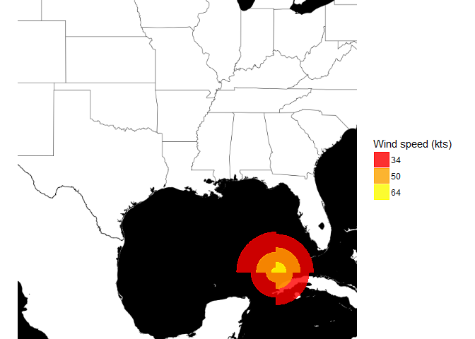

Introduction
------------

The following is the quick walk-through for building a hurricane geom as
the final assignment of John Hopskin's Building Data Visualizaton Tools
course on Coursera. My purpose is to provide a quick guide to understand
the problem that many are struggling with.

Loading the following packages for the project

    library(ggplot2)
    library(ggmap)
    library(tidyverse)
    library(lubridate)
    library(geosphere)
    library(grid)
    source("build_geom.R")
    ike2 <- readRDS("ike2")

The task
--------

The purpose of this assignment is to draw on your knowledge of the grid
and ggplot2 package to build a new geom. You will then need to load and
tidy the provided dataset in order to plot the geom on a map. In short
you will build this:

    map_plot <- ggmap::get_map("Lousiana", zoom = 5, maptype = "toner-background") 

    map_plot %>%
        ggmap::ggmap(extent = "device") +
        geom_hurricane(data = ike2,
                       ggplot2::aes(x = longitude, y = latitude, 
                                    r_ne = ne, r_se = se, r_nw = nw, r_sw = sw,
                                    color = wind_speed, fill = wind_speed)) +
        ggplot2::scale_color_manual(name = "Wind speed (kts)", 
                                    values = c("red", "orange", "yellow")) + 
        ggplot2::scale_fill_manual(name = "Wind speed (kts)", 
                                   values = c("red", "orange", "yellow"))

Breaking down the problems
--------------------------

While the problem seems complicated at first glance (and it is),
breaking it down to few simple steps can help you understand it right
away.

1.  Tidy the data to have the same columns as shown. Change the data
    type as you see fit. Notice the order of the last 4 columns: it is
    not in the order of ne -&gt; se -&gt; sw -&gt; nw yet. BUT, you have
    to build the geom in the right order by passing it to the
    required\_aes as the right order or else it will be a mess to fix
    later on!

<!-- -->

    ike2

    ## # A tibble: 3 x 9
    ##   storm_id                date latitude longitude wind_speed    ne    nw
    ##      <chr>              <dttm>    <dbl>     <dbl>      <chr> <int> <int>
    ## 1 IKE-2008 2008-09-10 06:00:00     23.4     -84.6         34   170   180
    ## 2 IKE-2008 2008-09-10 06:00:00     23.4     -84.6         50   110    90
    ## 3 IKE-2008 2008-09-10 06:00:00     23.4     -84.6         64    45    20
    ## # ... with 2 more variables: se <int>, sw <int>

1.  The longitude (negative) and latitude in the above table will be the
    center of the graph. The values in ne, se, sw, nw columns are radius
    of respective the quadrants after they are transform into the
    nautical miles to use on map. This is nothing more than multiply the
    value by 1852.

<!-- -->

    data.frame(old = ike2$ne, new = ike2$ne * 1852)

    ##   old    new
    ## 1 170 314840
    ## 2 110 203720
    ## 3  45  83340

1.  To create the graph, it is nothing more than connecting the points.
    Specifically, you use the center (lat & long) and radius (ne, se,
    sw, nw) to find all the points (in longitude and latitude) to create
    each quadrant circle. geosphere::destPoint will make this easy.
    NOTICE the order of the direction. We are going around a circle from
    left to right!!!

As an example, lets say I take the first row of the above table and plot
the points for the first circle.

    temp <- ike2[1,]
    arc <- data.frame(start_arc = c(0, 90, 180, 270),
                      end_arc = c(90, 180, 270, 360))
    # Transform to long data
    temp <- temp %>%
        gather("direction", "wind_radius", c("ne", "se", "sw", "nw"))%>%
        bind_cols(arc)

    ## Create the data frame of all points
    points <- data.frame()
    for(i in 1:nrow(temp)){
        out <- geosphere::destPoint(p = c(temp[i,]$longitude, temp[i,]$latitude),
                             b = temp[i,]$start_arc:temp[i,]$end_arc,
                             d = temp[i,]$wind_radius)
        out <- as.data.frame(out)
        names(out) <- c("longitude", "latitude")
        points <- bind_rows(points, out)
    }
    head(points)

    ##   longitude latitude
    ## 1 -84.60000 23.40153
    ## 2 -84.59997 23.40153
    ## 3 -84.59994 23.40153
    ## 4 -84.59991 23.40153
    ## 5 -84.59988 23.40153
    ## 6 -84.59986 23.40153

    plot(points)

Now you see destPoint in action, the rest is to connect them with
polygonGrob and you are done.

1.  The last point is how to put all these ideas into the geom. Remember
    to create a geom you create 2 things: a geom class (lets call it
    GeomHurricane) and a wrapper geom call (geom\_hurricane). The geom
    class will handle everything and the geom call you just need to copy
    exactly like in the book with geom = GeomHurricane.

#### Important

There are 6 required aes (x, y, r\_ne, r\_se, r\_sw, r\_nw) passed to
the call (and thus the class). This is nothing more than creating a
dataframe of all these required columns which are all you need to build
the graph.

Secondly, draw\_group will AUTOMATICALLY loop over each row of the data
so you will input the code to work with ONE ROW only. (Read the
build\_geom.R for more)

Final Notes
-----------

Trying out destPoint for yourself will help you tremendously to
understand the problem. Moreover, don't get angry if you are stuck on
something. Relax and start reading the documentation of what you don't
understand. It is a very good learning experiment for my part.

And lastly, have fun!
